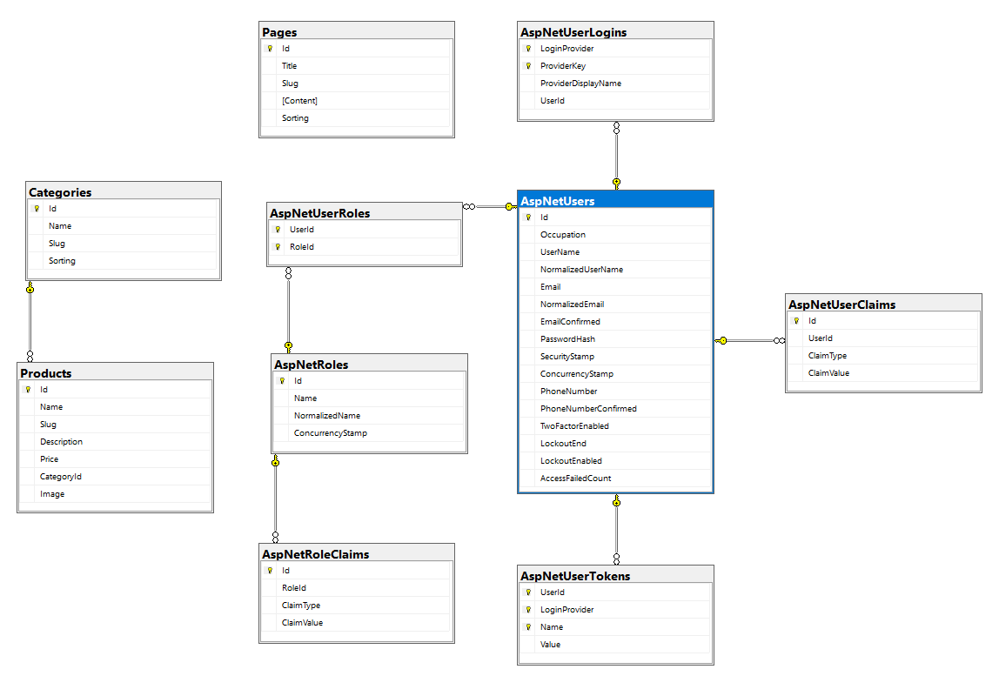

# CMS Shopping Cart

A content management system (CMS) and shopping cart built with ASP.NET Core 6 MVC, utilizing Microsoft.AspNetCore.Identity for user management, and integrating PayPal for checkout. This project allows users to view products by category, add products to a cart, and complete purchases.

## Table of Contents

- [CMS Shopping Cart](#cms-shopping-cart)
  - [Table of Contents](#table-of-contents)
  - [Features](#features)
  - [Technologies](#technologies)
  - [Installation](#installation)
  - [Configuration](#configuration)
  - [Database Schema](#database-schema)
    - [Categories Table](#categories-table)
    - [Products Table](#products-table)
    - [Pages Table](#pages-table)
    - [AspNetUsers Table](#aspnetusers-table)
  - [Seed Data](#seed-data)
  - [Usage](#usage)
  - [Contact](#contact)

## Features

- Dynamic page creation using CKEditor
- Product listing and categorization
- Shopping cart functionality
- PayPal integration for checkout
- User roles and authentication with ASP.NET Core Identity
- User registration and account management

- Admin area for managing categories, pages, products, roles, and users

## Technologies

- ASP.NET Core 6 MVC
- Entity Framework Core
- Microsoft.AspNetCore.Identity
- CKEditor
- HTML, CSS, JavaScript

## Installation

1. Clone the repository:

   ```bash
   git clone https://github.com/AbdulfattahHessein/CmsShoppingCart.git
   cd CmsShoppingCart
   ```

2. Install the required packages:

   ```bash
   dotnet restore
   ```

## Configuration

1. Update the `appsettings.json` file in the project root with your own settings:

   ```json
   {
     "Logging": {
       "LogLevel": {
         "Default": "Information",
         "Microsoft": "Warning",
         "Microsoft.Hosting.Lifetime": "Information"
       }
     },
     "AllowedHosts": "*",
     "ConnectionStrings": {
       "CmsShoppingCartContext": "Server=.; Database=CmsShoppingCartContext; Trusted_Connection=True; MultipleActiveResultSets=true"
     },
     "AdminUser": {
       "UserName": "admin",
       "Email": "admin@example.com",
       "Password": "Admin@123"
     }
   }
   ```

## Database Schema



### Categories Table

- **Id**: Primary key
- **Name**: Name of the category
- **Slug**: URL-friendly version of the category name
- **Sorting**: Integer for sorting order

### Products Table

- **Id**: Primary key
- **Name**: Name of the product
- **Slug**: URL-friendly version of the product name
- **Description**: Description of the product
- **Price**: Price of the product
- **CategoryId**: Foreign key linking to the Categories table
- **Image**: URL or path to the product image

### Pages Table

- **Id**: Primary key
- **Title**: Title of the page
- **Slug**: URL-friendly version of the page title
- **Content**: HTML content of the page
- **Sorting**: Integer for sorting order

### AspNetUsers Table

- Includes fields from ASP.NET Core Identity for user management

## Seed Data

The project includes a `SeedData` class to populate initial data:

- Roles: `admin`, `editor`
- Admin user with credentials from `appsettings.json`
- Initial pages: Home, About Us, Services, Contact

The database is automatically migrated and seeded with initial data when the application starts. This is handled in the `Program.cs` file.

## Usage

1. Run the application:

   ```bash
   dotnet run
   ```

2. Register for an account to access additional features such as saving carts and managing orders.

3. you can Log in with the admin credentials specified in `appsettings.json` to access administrative features.

## Contact

For any inquiries, please contact [abdulfattah.hessein@gmail.com](mailto:yourname@example.com).

---

Thank you for checking out our project! We hope it meets your needs and welcome any feedback or contributions.
